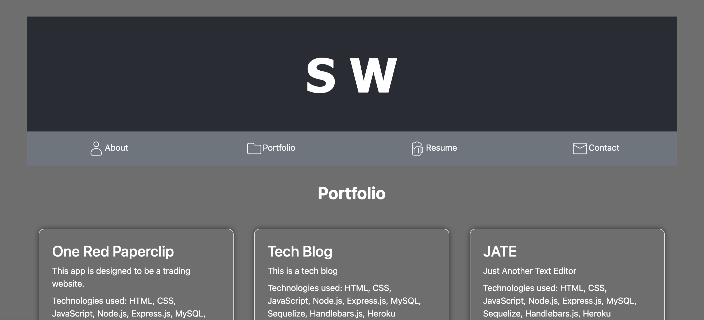

# React Portfolio

## Table of Contents
  - [Installation](#installation)
  - [Usage](#usage)
  - [Testing](#testing)
  - [License](#license)
  - [Links](#Links)
  

## Description

This project is designed to demonstrate my ability to create an application using vite/react.

 ## Installation 

 To install this application, git clone thie repository to your local computer. The user must also run npm install as well.

 ## Usage

This application is deployed to netlify, you can follow the link below to navigate to the site.

## Testing

You can test this application  by running the command line prompt "npm start" after installing the required node packages from VS code and using live preview to demo the pwa.

## Licenses

This project is covered under the MIT License
https://opensource.org/licenses/MIT

## Links

Git Hub: https://github.com/BabyStu/portfolio.git

Deployed Site: https://main--lighthearted-paletas-2d299e.netlify.app/